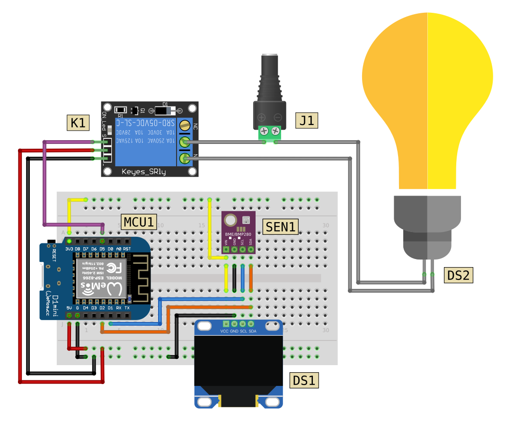

# Egg Incubator

## Breadboard Circuit

## Component List

|Code|Description|
|:--|:--|
|MCU1|Wemos D1 Mini|
|SEN1|BME280 Atmospheric Sensor (I2C)|
|DS1|SSD1306 128x64 OLED Display (I2C)|
|DS2|Heating Lamp|
|K1|Relay Module (5V)|
|J1|Barrel Jack (to lamp power supply)|
